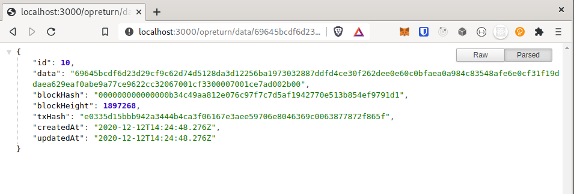

# Test Asset Integration Engineer - Exodus
## Requirements & Rules
- [x] store Bitcoin OP_RETURN data
- [x] index Bitcoin OP_RETURN data
- [x] time limit: 8 hours
- [x] serve on an HTTP endpoint as a JSON payload
- [x] payload should include transaction hash and block hash
- [x] NodeJS
- [x] any 3rd-party npm library
- [x] Postgres as database
- [x] Bitcoin ~~mainnet~~ or testnet
- [x] use bitcoind

### Example
Transaction [8bae12b5f4c088d940733dcd1455efc6a3a69cf9340e17a981286d3778615684](https://www.smartbit.com.au/tx/8bae12b5f4c088d940733dcd1455efc6a3a69cf9340e17a981286d3778615684) has `OP_RETURN` 636861726c6579206c6f766573206865696469 that decoded leads to "charley loves heidi".


## Getting started
Requirements: yarn, postgres, nodeJS/npm
1. bitcoin-core client config
  See [bitcoin.conf](./bitcoin.conf).  
  Especially pay attention to the `rpcworkqueue` setting to avoid the following error (in debug.log file). I haven't run into errors by setting it to 500.
    ```
    WARNING: request rejected because http work queue depth exceeded, it can be increased with the -rpcworkqueue= setting
    ```
1. Install dependencies: `cd <db|indexer|json-api> && yarn`
2. Set up DB
    - Requirements: PostgreSQL
    - Create `opreturn` DB:
      ```
      sudo su - postgres
      psql
      ALTER USER r1oga WITH PASSWORD 'exodus'; # change user and pwd
      \q
      exit
      psql -d postgres
      CREATE DATABASE opreturn;
      # check DB was created:
      \l
      ```
2. Check config settings in [db/config.ts](./db/config.ts) and [indexer/config.ts](./indexer/config.ts).
  Default:
    ```
      postgres:
        host: 'localhost',
        dialect,
        db: 'opreturn',
        username: 'r1oga',
        password: 'exodus'
      bitcoind:
        host: '127.0.0.1', // default
        username: 'r1oga',
        password: 'exodus',
        port: 8332 // default
    ```
2. Index blocks: `cd indexer && yarn start`
2. Start json-api: `cd json-api && yarn start`. Access api at [http://localhost:3000/](http://localhost:3000/)

## Tests: `yarn test` (in respective packages/folders:)

## DB Schema
|Column|Type|Description|
|--|--|--|
|data|TEXT|OP RETURN data|
|blockHash|TEXT|
|blockHeight|INTEGER|
|txHash|TEXT|txid|

## API
### Routes
|METHOD|ROUTE|
|--|--|
|GET|/opreturn/blockheight/:blockHeight|
|GET|/opreturn/blockhash/:blockHash|
|GET|/opreturn/data/:data|

## Demo




## Resource
- How to read read raw OP_RETURN data from blocks: refactored version of functions found in [blockai-unofficial/raw-op-return](https://github.com/blockai-unofficial/raw-op-return)

